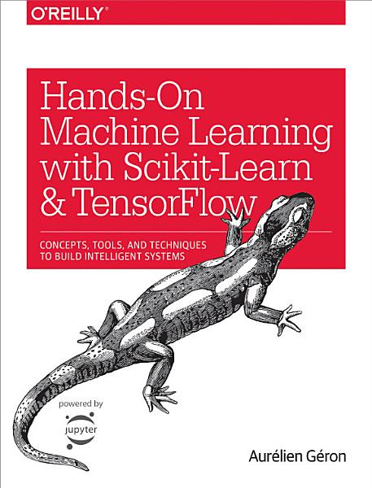

# Hands On Machine Learning
## with Scikit-Learn and TensorFlow

This repository is my notes and exercise solutions while I was reading
_Hands On Machine Learning with Scikit-Learn and TensorFlow_ by Aurélian Géron.

All of the code and notes are written in [Jupyter](https://jupyter.org/)
notebooks that are written to run in
[Google Colab](https://colab.research.google.com). This allows me to not
need to set up a virtual environment and install machine learning libraries
each time. Colab has most of the modules this book uses installed by default.
There is some Colab specific code in here that will not work on a
run-of-the-mill Jupyter Notebook kernel. There are aslo differences in how
mathematical formuals are rendered in Colab than in Github's `ipynb` renderer.

## Table of Contents

1. [Topics Covered](#topics-covered)
2. [Academic Papers Cited](#academic-papers-cited)
3. [License](#license)

## Topics Covered

### Chapter 2: End to End Machine Learning Project

#### `Housing.ipynb`
- Downloading data for a machine learning project.
- Inspecting data with `pandas`.
- Plotting histograms of the data.
- Splitting data into training and test sets.
- Discretizing continuous features.
- Visualizing geographic data.
- Computing the correlation between features with `pandas`.
- Visualizing relationships between features using scatter plots.
- Combining features to make new ones.
- Cleaning the data for machine learning.
- Handling categorical features using `OneHotEncoder`.
- Defining custom feature transformations.
- Scikit-Learn's `Pipeline` object.
- Computing the root mean squared error (RMSE) of a regression model.
- Cross validation.
- Grid searching hyperparameters with Scikit-Learn's `GridSearchCV`.
- Evaluating models with a test set.
- Training a Support Vector Machine (SVM) on the Housing dataset.
- Fine tuning a `RandomForestRegressor` using `RandomizedSearchCV`.
- Creating a pipeline for a machine learning model with the Housing dataset.

### Chapter 3: Classification

#### `MNIST.ipynb`
- The MNIST dataset, a dataset of images of handwritten digits.
- Training a binary classifier.
- Measuring accuracy of a classifier model.
- Confusion matrix.
- Precision and recall.
- F1 score.
- Precision/recall tradeoff.
- The receiver operating characteristic (ROC) curve.
- Multiclass classifier.
- Error analysis using the confusion matrix and plotting examples where the
model was wrong.
- Multilabel classification.
- Multioutput classification.

#### `SpamClassifier.ipynb`
- Downloading the email dataset.
- Processing email data in Python.
- Counting the most common words and symbols in text data.
- Viewing the headers in email data with Python.
- Parsing HTML into plaintext with Python.
- Transforming words into their stems with Scikit-Learn's `PorterStemmer`
class.
- Extracting URLs from text with Python.
- Defining a transformer class using Scikit-Learn which extracts the word
counts from email data.
- Defining a transformer class which transforms word counts into a vector
which can be used as an input to a machine learning model.
- Using `LogisticRegression` to classify emails as spam or ham.
- Evaluating the model's performance with cross-validation.

#### `Titanic.ipynb`

- Downloading the Titanic dataset from [Kaggle](https://www.kaggle.com/).
- Defining a `Pipeline` to transform the data from Kaggle into input for a
machine learning model.
- Train an `SGDClassifier` to determine if a passenger survived or died on
the Titanic.
- Evaluate the `SGDClassifier` with cross-validation.
- Do a grid search with `GridSearchCV` to fine tune the hyperparameters of
a `RandomForestClassifier`.

### Chapter 4: Training Models

#### `TrainingModels.ipynb`
- Linear Regression.
- Mean squared error (MSE).
- The normal equation and its computational complexity.
- Batch Gradient Descent.
- Learning rate.
- Stochastic Gradient Descent.
- Mini-Batch Gradient Descent.
- Polynomial regression with Scikit-Learn.
- Learning curves.
- Regularization.
- Ridge Regression with Scikit-Learn.
- Lasso Regression with Scikit-Learn.
- Elastic Net with Scikit-Learn.
- Early stopping.
- Logistic Regression.
- Decision boundaries.
- Softmax Regression with Scikit-Learn on the Iris dataset.
- Implementing Batch Gradient Descent and Softmax Regression without using
Scikit-Learn.

### Chapter 5: Support Vector Machines

#### `SupportVectorMachines.ipynb`
- Linear Support Vector Machine (SVM) classification.
- Hard margin classification.
- Soft margin classification.
- Scikit-Learn's `LinearSVM` classifier.
- Nonlinear SVMs classification.
- Using polynomial kernels for SVM classification.
- Adding features using a similarity function and landmark instances.
- Gaussian Radial Bias Function (RBF).
- Using Gaussian RBF kernels for SVM classification.
- Computational complexity of SVMs.
- SVM Regression.
- Scikit-Learn's `LinearSVR` class.
- Nonlinear SVM regression using Scikit-Learn's `SVR` class.
- The SVM decision function.
- The training objective for an SVM for hard and soft margin classification.
- Quadratic programming.
- Solving the dual problem of a quadratic programming problem.
- Kernelized SVMs and applying the kernel trick.
- Computing the decision function for a nonlinear SVM using the kernel trick.
- Online SVMs.
- Using the hinge loss function for Gradient Descent.
- Using a QP solver to train an SVM by solving the dual problem.
- Comparing training a `LinearSVC` and a `SGDClassifier` class to get the same
model.
- Training SVM classifier to classify handwritten digits.
- Training an SVM regression model to predict housing prices with the
California housing dataset.

### Chapter 6: Decision Trees

#### `DecisionTrees.ipynb`

- Training a `DecisionTreeClassifier` with Scikit-Learn.
- Visualizing a Decision Tree's decision making algorithm.
- Making predictions with a Decision Tree.
- Gini impurity.
- White-box versus black-box models.
- Estimating class probabilities with a `DecisionTreeClassifier`.
- The Classification And Regression Tree (CART) algorithm.
- The computational complexity of training and making predictions with a
Decision Tree.
- Using entropy instead of Gini impurity to train a Decision Tree.
- Parametric versus nonparametric machine learning models.
- Training a `DecisionTreeRegressor` with Scikit-Learn.
- The cost function for training a Decision Tree for regression.
- Computing the approximate depth of a Decision Tree.
- Train a `DecisionTreeClassifier` to classify instances of the moons dataset.
- Implementing a Random Forest using Scikit-Learn's `DecisionTreeClassifier`.

### Chapter 7: Ensemble Learning

#### `EnsembleLearning.ipynb`

- Voting classifiers.
- Hard voting classifiers.
- Strong leaner versus weak learners.
- Scikit-Learn's `VotingClassifier` class.
- Bagging and pasting.
- Scikit-Learn's `BaggingClassifier`.
- Out-of-bag evaluation.
- Random Patches and Random Subspaces.
- Scikit-Learn's `RandomForestClassifier`.
- Extremely Randomized Trees (Extra-Trees).
- Feature importance.
- Boosting (in the context of Emsemble Learning).
- AdaBoost.
- Using Scikit-Learn's `AdaBoostClassifier`.
- Gradient Boosting, Gradient Tree Boosting, and Gradient Boosted Regression
Trees (GBRTs).
- Training a GRBT with and without Scikit-Learn's `GradientBoostingRegressor`
class.
- Stacked generalization (stacking).
- Training an voting ensemble model on the MNIST dataset using Scikit-Learn.
- Training an ensemble which uses stacking and comparing the results to the
voting ensemble.

### Chapter 8: Dimensionality Reduction

#### `DimensionalityReduction.ipynb`

- The curse of dimensionality.
- Projection.
- Manifold learning and the manifold hypothesis.
- Principal Component Analysis (PCA).
- Singular Value Decomposition (SVD).
- `PCA` with Scikit-Learn.
- Explained variance ratio.
- Reconstructing the original data after PCA and reconstruction error.
- Incremental PCA (IPCA).
- `IncrementalPCA` with Scikit-Learn.
- Randomized PCA.
- Kernel PCA (kPCA).
- `KernelPCA` with Scikit-Learn.
- Locally Linear Embedding (LLE).
- `LocallyLinearEmbedding` with Scikit-Learn.
- Multidimensional Scaling (MDS).
- Isomap.
- t-Distributed Stochastic Neighbor Embedding (t-SNE).
- Linear Discriminant Analysis (LDA).
- Training a Random Forest with the MNIST dataset and observing how PCA helps
reduce the time it takes to train the model.
- Reducing the dimension of the MNIST dataset and plotting the result.

### Chapter 9: Up and Running with Tensorflow

#### `UpAndRunningWithTensorflow.ipynb`

- Creating a TensorFlow graph.
- Running a computation defined with a TensorFlow graph.
- Managing TensorFlow graph.
- Lifecycle of a node value.
- Linear Regression with TensorFlow.
- Manually computing the gradient versus using the autodiff algorithm versus
using a `GradientDescentOptimizer`.
- Gradient Descent using a `MomentumOptimizer`.
- Feeding data to a training algorithm using `tf.placeholder()`.
- Implementing Mini-Batch Gradient Descent with TensorFlow.
- Saving and restoring a model.
- Visualizing the graph and training curves using TensorBoard in Google Colab.
- Name scopes.
- Rectified linear units (ReLU).
- Creating a neural network by iteratively applying ReLU operations.
- Sharing variables.
- Implementing Logistic Regression using TensorFlow.

### Chapter 10: Introduction to Artificial Neural Networks

#### `ArtificialNeuralNetworks.ipynb`

- The invention of artificial neural networks (ANNs).
- Biological neurons.
- Performing computations with artificial neurons.
- Perceptrons and Linear threshold units (LTUs).
- Hebb's rule (Hebbian learning).
- TensorFlow's `Perceptron` class.
- Multilayer perceptrons (MLPs) and deep neural networks (DNNs).
- Backpropagation.
- Softmax function.
- Feedforward neural networks (FNNs).
- Training a DNN with TensorFlow's high-level API.
- Training a DNN with plain TensorFlow.
- Fine tuning neural network parameters.
- Training a DNN for classifying the MNIST dataset.

### Chapter 11: Training Deep Neural Nets

#### `TrainingDeepNeuralNets.ipynb`

- The vanishing/exploding gradients problem.
- Xavier and He initialization.
- Leaky ReLU activation function.
- Exponential linear unit (ELU) activation function.
- Batch Normalization.
- Implementing Batch Normalization with TensorFlow.
- Gradient clipping.
- Reusing pretrained models.
- Reusing pretrained TensorFlow models.
- Reusing models from other frameworks when using TensorFlow.
- Freezing lower layers with TensorFlow.
- Caching frozen layers.
- Model zoos.
- Unsupervised pretraining.
- Pretraining with an auxilary task.
- Momentum optimizers.
- TensorFlow's `MomentumOptimizer`.
- Nesterov Accelerated Gradient.
- AdaGrad algorithm.
- TensorFlow's `AdagradOptimizer`.
- RMSProp algorithm.
- TensorFlow's `RMSPropOptimizer`.
- Adaptive moment estimation (Adam).
- TensorFlow's `AdamOptimizer`.
- Learning rate scheduling.
- Using regularization while training a neural network.
- Implementing regularization with TensorFlow.
- Dropout and implementing models that use dropout with TensorFlow.
- Follow the Regularized Leader (FTRL).
- FTRL-Proximal and the `FTRLOptimizer` class.
- Max-norm regularization and implementing it in TensorFlow.
- Data augmentation.
- Training a DNN to classify the MNIST dataset.
- Transfer learning with the MNIST dataset.
- Pretraining with an auxilary task before training a DNN to classify the
MNIST dataset.

### Chapter 12: Distributing TensorFlow Across Devices and Servers

#### `DistributingTensorflow.ipynb`

- Nvidia's Compute Unified Device Architecture library (CUDA).
- Managing the GPU RAM.
- Placing operations on devices.
- Dynamic placer algorithm versus a simple lacer.
- Logging which device each node is pinned to.
- Parallel execution in TensorFlow.
- Distributing devices across multipe servers.
- TensorFlow cluster specifications.
- Master and worker services.
- Sharing variables across servers.
- Resource containers.
- TensorFlow queues.
- Asychronous communication using queues.
- TensorFlow's `FIFOQueue`.
- TensorFlow's `RandomShuffleQueue`.
- TensorFlow's `PaddingFIFOQueue`.
- Multithreaded readers using TensorFlow's `Coordinator` and `QueueRunner`.
- TensorFlow's `string_input_producer()` function.
- TensorFlow's `input_producer()`, `range_input_producer()`, and
`slice_input_producer()` functions.
- TensorFlow's `shuffle_batch()` function.
- In-graph versus between-graph replication.
- Model parallelism.
- Data parallelism.
- Synchronous versus asynchronous updates.
- Bandwidth saturation.
- Training multiple TensorFlow DNNs in parallel.

#### `ParallelNeuralNetworks.ipynb`
- Training a distributed DNN with TensorFlow.
- Comparing the performance of synchronous versus asynchronous updates.

### Chapter 13: Convolutional Neural Networks

#### `ConvolutionalNeuralNetworks.ipynb`

- The visual cortex in animals and local receptive fields.
- Convolutional neural networks (CNNs).
- Convolutional layers.
- Zero padding.
- Stride.
- Filters and feature maps.
- Stacking feature maps.
- Convolutional layers in TensorFlow.
- VALID versus SAME padding.
- Memory requirements of a CNN.
- Pooling layers.
- ILSVRC ImageNet challenge and other visual challenges CNNs can solve.
- LeNet-5.
- AlexNet.
- GoogLeNet.
- Residual Network (ResNet).
- VGGNet and Inception-v4.
- Convolution operations with TensorFlow.

#### `DeepDream.ipynb`

- Displaying a model graph from TensorBoard inline in Colab.
- Naive feature map visualization.
- Improving the visualization using gradient ascent.
- Laplacian Pyramid Gradient Normalization.
- Visualizing different feature maps in the Inception model.
- Google's DeepDream algorithm.

#### `Inception.ipynb`

- Preparing data for the Inception v3 model.
- Downloading the pretrained Inception v3 model.
- Defining the Inception v3 model graph with TensorFlow.
- Restoring the model parameters for a TensorFlow model.
- Labeling images with the Inception v3 and TensorFlow.
- Implementing data augmentation for image data using `numpy`.
- Creating a model graph with pretrained lower layers from the Inception v3
model.
- Training the higher layers of the new model for a different classification
task.

#### `MNIST.ipynb`

- Implementing an augmented version of LeNet-5 using TensorFlow.
- Training a CNN to classify the MNIST dataset with over 99% accuracy.

### Chapter 14: Recurrent Neural Networks

#### `RecurrentNeuralNetworks.ipynb`

- Recurrent neural networks (RNNs).
- Recurrent neurons.
- Implementing recurrent neurons in TensorFlow.
- Static unrolling through time with TensorFlow.
- Dynamic unrolling through time with TensorFlow's `BasicRNNCell`.
- Handling variable input sequence lengths in TensorFlow.
- Handling variable output sequence lengths.
- Backpropagation through time (BPTT).
- Training a sequence classifier with TensorFlow.
- Training a model to predict time series.
- Generating new sequences with creative RNNs.
- Deep RNNs and TensorFlow's `MultiRNNCell`.
- Creating a deep RNN across devices.
- Applying dropout while training an RNN.
- The difficulty of training RNNs for long sequences.
- Truncated backpropagation through time.
- Long Short-Term Memory (LSTM) cell.
- TensorFlow's `BasicLSTMCell`.
- Peephole connections.
- Gated Recurrent Unit (GRU) cell.
- TensorFlow's `GRUCell`.
- Natural language processing (NLP).
- Word embeddings.
- Computing embeddings using TensorFlow.
- Defining a model graph for sequence-to-sequence machine translation using
TensorFlow.

#### `Exercises.ipynb`

- Embedded Reber grammars.
- Training a model to classify if a sequence is a Reber grammar using
TensorFlow.
- Training a model for the "How Much Did it Rain II" Kaggle competition.
- Developing a Spanish-to-English translation system using TensorFlow.

### Chapter 15: Autoencoders

#### `Autoencoders.ipynb`

- Autoencoders.
- Codings.
- Undercomplete autoencoders.
- Performing PCA with a undercomplete linear autoencoder using TensorFlow.
- Stacked autoencoders.
- Training a stacked autoencoder with TensorFlow.
- Tying weights.
- Training one autoencoder at a time in multiple TensorFlow graphs.
- Training one autoencoder at a time in a single TensorFlow graph.
- Caching outputs from the frozen layer to speed up training.
- Visualizing the reconstructions.
- Visualizing the extracted features.
- Unsupervised pretraining using an autoencoder for a classification task.
- Stacked denoising autoencoders.
- Sparse autoencoders.
- Kullback-Leibler divergence.
- Variational autoencoders.
- Latent loss.
- Implementing a variational autoencoder using TensorFlow.
- Contractive autoencoders.
- Stacked convolutional autoencoders.
- Generative stochastic networks (GSNs).
- Winner-take-all (WTA) autoencoders.
- Generative adversarial networks (GANs).

#### `Exercises.ipynb`

- Pretraining with a convolutional autoencoder to train an image classification
model using TensorFlow.
- Semantic hashing.
- Implementing an autoencoder to compute semantic hashes of images using
TensorFlow.
- Training a semantic hashing model by pretraining a CNN for image
classification.
- Training a convolutional variational autoencoder (CVAE) to generate new
instances of the Oxford Flowers dataset.

### Chapter 16: Reinforcement Learning

#### `ReinforcementLearning.ipynb`

- Reinforcement learning.
- Policy and policy search.
- Genetic algorithms.
- Policy gradients.
- OpenAI Gym.
- Ms. Pacman OpenAI Gym environment.
- CartPole OpenAI Gym environment.
- Hard coding a policy.
- Neural network policies with TensorFlow.
- Training a neural network to learn a hard-coded policy.
- The credit assignment problem.
- REINFORCE algorithms.
- Training a neural network agent for the CartPole environment using policy
gradients.
- Markov chains.
- Markov decision processes (MDPs).
- Bellman Optimality Equation.
- Value Iteration algorithm.
- Q-Values.
- Temporal Difference Learning (TD Learning).
- Approximate Q-Learning and Deep Q-Learning.
- Deep Q-networks (DQNs).
- Replay memory.
- Preprocessing observations from the Breakout OpenAI Gym environment.

#### `MsPacMan.ipynb`
- The Ms. Pacman OpenAI Gym environment.
- Preprocessing the observations from the Ms. Pacman environment.
- Training a DQN to play Ms. Pacman.

#### `Exercises.ipynb`

- The BipedalWalker Open AI Gym environment.
- Training a neural network policy for the BipedalWalker environment using
policy gradients.
- The Pong Open AI Gym environment.
- Preprocessing the Pong environment for training a DQN.
- Training a DQN to play Pong.

## Papers Cited

### Artificial Neural Networks

- [_Random Search for Hyper-Parameter Optimization_, James Bergstra, Yoshua Bengio](http://www.jmlr.org/papers/volume13/bergstra12a/bergstra12a.pdf)
- [_A logical calculus of the ideas immanent in nervous activity_, Warren S. McCullochWalter Pitts](https://link.springer.com/article/10.1007/BF02478259)
- [_Learning Internal Representations by Error Propagation_, David E. Rumelhart, Geoffrey E. Hinton, Ronald J. Williams](https://apps.dtic.mil/docs/citations/ADA164453)

### Autoencoders

- [_GSNs: Generative Stochastic Networks_, Guillaume Alain, Yoshua Bengio, Li Yao, Jason Yosinski, Eric Thibodeau-Laufer, Saizheng Zhang, Pascal Vincent](https://arxiv.org/pdf/1503.05571v2.pdf)
- [_Tutorial on Variational Autoencoders_, Carl Doersch](https://arxiv.org/pdf/1606.05908.pdf)
- [_Generative Adversarial Networks_, Ian J. Goodfellow, Jean Pouget-Abadie, Mehdi Mirza, Bing Xu, David Warde-Farley, Sherjil Ozair, Aaron Courville, Yoshua Bengio](https://arxiv.org/abs/1406.2661)
- [_CNN Based Hashing for Image Retrieval_, Jinma Guo, Jianmin Li](https://arxiv.org/pdf/1509.01354.pdf)
- [_Auto-Encoding Variational Bayes_, Diederik P. Kingma, Max Welling](https://arxiv.org/pdf/1312.6114v10.pdf)
- [_Winner-Take-All Autoencoders_, Alireza Makhzani, Brendan Frey](https://arxiv.org/pdf/1409.2752v2.pdf)
- [_Stacked Convolutional Auto-Encoders for Hierarchical Feature Extraction_, Jonathan Masci, Ueli Meier, Dan Cire¸san, Jürgen Schmidhuber](http://people.idsia.ch/~ciresan/data/icann2011.pdf)
- [_Contractive Auto-Encoders: Explicit Invariance During Feature Extraction_, Salah Rifai, Pascal Vincent, Xavier Muller, Xavier Glorot, Yoshua Bengio](http://www.icml-2011.org/papers/455_icmlpaper.pdf)
- [_Semantic hashing_, Ruslan Salakhutdinov, Geoffrey Hinton](http://www.cs.toronto.edu/~rsalakhu/papers/sdarticle.pdf)
- [_Extracting and Composing Robust Features with Denoising Autoencoders_, Pascal Vincent, Hugo Larochelle, Yoshua Bengio, Pierre-Antoine Manzagol](https://www.iro.umontreal.ca/~vincentp/Publications/denoising_autoencoders_tr1316.pdf)
- [_Stacked Denoising Autoencoders: Learning Useful Representations in a Deep Network with a Local Denoising Criterion_, Pascal Vincent, Hugo Larochelle, Isabelle Lajoie, Yoshua Bengio, Pierre-Antoine Manzagol](http://jmlr.csail.mit.edu/papers/volume11/vincent10a/vincent10a.pdf)

### Convolutional Neural Networks

- [_Deep Residual Learning for Image Recognition_, Kaiming He, Xiangyu Zhang, Shaoqing Ren, Jian Sun](https://arxiv.org/pdf/1512.03385v1.pdf)
- [_Receptive Fields of Single Neurones in the Cat's Striate Cortex_, D. H. Hubel, T. N. Wiesel](https://www.ncbi.nlm.nih.gov/pmc/articles/PMC1363130/pdf/jphysiol01298-0128.pdf)
- [_Single Unit Activity in Striate Cortex of Unrestrained Cats_, D. H. Hubel](https://www.ncbi.nlm.nih.gov/pmc/articles/PMC1357023/pdf/jphysiol01301-0020.pdf)
- [_ImageNet Classification with Deep Convolutional Neural Networks_, Alex Krizhevsky, Ilya Sutskever, Geoffrey E. Hinton](http://papers.nips.cc/paper/4824-imagenet-classification-with-deep-convolutional-neural-networks.pdf)
- [_Gradient-Based Learning Applied to Document Recognition_, Yann LeCun, Léon Bottou, Yoshua Bengio, Patrick Haffner](http://yann.lecun.com/exdb/publis/pdf/lecun-01a.pdf)
- [_Is object localization for free? – Weakly-supervised learning with convolutional neural network_, Maxime Oquab, Léon Bottou, Ivan Laptev, Josef Sivic](https://leon.bottou.org/publications/pdf/cvpr-2015.pdf)
- [_Fully Convolutional Networks for Semantic Segmentation_, Evan Shelhamer, Jonathan Long, Trevor Darrell](https://arxiv.org/pdf/1605.06211v1.pdf)
- [_Very Deep Convolutional Networks for Large-Scale Image Recognition_, Karen Simonyan, Andrew Zisserman](https://arxiv.org/pdf/1409.1556.pdf)
- [_End-to-end people detection in crowded scenes_, Russell Stewart, Mykhaylo Andriluka](https://arxiv.org/pdf/1506.04878.pdf)
- [_Going Deeper with Convolutions_, Christian Szegedy, Wei Liu, Yangqing Jia, Pierre Sermanet, Scott Reed, Dragomir Anguelov, Dumitru Erhan, Vincent Vanhoucke, Andrew Rabinovich](http://www.cs.unc.edu/~wliu/papers/GoogLeNet.pdf)

### Dimensionality Reduction

- [_Kernel Principal Component Analysis_, Bernhard Schölkopf, Alexander Smola , Klaus-Robert Müller](http://pca.narod.ru/scholkopf_kernel.pdf)

### Distributing TensorFlow

- [_TensorFlow: Large-Scale Machine Learning on Heterogeneous Distributed Systems_, Martin Abadi, Ashish Agarwal, Paul Barham, Eugene Brevdo, Zhifeng Chen, Craig Citro, Greg S. Corrado, Andy Davis, Jeffrey Dean, Matthieu Devin, Sanjay Ghemawat, Ian Goodfellow, Andrew Harp, Geoffrey Irving, Michael Isard, Yangqing Jia, Rafal Jozefowicz, Lukasz Kaiser, Manjunath Kudlur, Josh Levenberg, Dan Mane, Rajat Monga, Sherry Moore, Derek Murray, Chris Olah, Mike Schuster, Jonathon Shlens, Benoit Steiner, Ilya Sutskever, Kunal Talwar, Paul Tucker, Vincent Vanhoucke, Vijay Vasudevan, Fernanda Viegas, Oriol Vinyals, Pete Warden, Martin Wattenberg, Martin Wicke, Yuan Yu, Xiaoqiang Zheng](http://download.tensorflow.org/paper/whitepaper2015.pdf)
- [_Revisting Distributed Synchronous SGD_, Jianmin Chen, Rajat Monga, Samy Bengio, Rafal Jozefowicz](https://arxiv.org/pdf/1604.00981v2.pdf)

### Ensemble Learning

- [_Arcing The Edge_, Leo Breiman](http://statistics.berkeley.edu/sites/default/files/tech-reports/486.pdf)
- [_Bagging Predictors_, Leo Breiman](http://statistics.berkeley.edu/sites/default/files/tech-reports/421.pdf)
- [_Pasting Small Votes for Classification in Large Databases and On-Line_, Leo Breiman](https://link.springer.com/article/10.1023/A:1007563306331)
- [_A Decision-Theoretic Generalization of On-Line Learning and an Application to Boosting_, Yoav Freund, Robert E. Schapire](https://www.sciencedirect.com/science/article/pii/S002200009791504X)
- [_Extremely randomized trees_, Pierre Geurts, Damien Ernst, Louis Wehenkel](https://orbi.uliege.be/bitstream/2268/9357/1/geurts-mlj-advance.pdf)
- [_Multi-class AdaBoost_, Ji Zhu, Saharon Rosset, Hui Zou, Trevor Hastie](https://web.stanford.edu/~hastie/Papers/samme.pdf)

### Recurrent Neural Networks

- [_Learning Phrase Representations using RNN Encoder–Decoder for Statistical Machine Translation_, Kyunghyun Cho, Bart van Merrienboer, Caglar Gulcehre, Dzmitry Bahdanau, Fethi Bougares, Holger Schwenk, Yoshua Bengio](https://arxiv.org/pdf/1406.1078v3.pdf)
- [_Recurrent nets that time and count_, F. A. Gers, J. Schmidhuber](https://ieeexplore.ieee.org/document/861302)
- [_Long Short-Term Memory_, Sepp Hochreiter, Jürgen Schmidhuber](https://www.mitpressjournals.org/doi/abs/10.1162/neco.1997.9.8.1735#.WIxuWvErJnw)
- [_Long Short-Term Memory Based Recurrent Neural Network Architectures for Large Vocabulary Speech Recognition_, Hasim Sak, Andrew Senior, Françoise Beaufays](https://arxiv.org/pdf/1402.1128.pdf)
- [_Show and Tell: A Neural Image Caption Generator_, Oriol Vinyals, Alexander Toshev, Samy Bengio, Dumitru Erhan](https://arxiv.org/pdf/1411.4555v2.pdf)
- [_Recurrent Neural Network Regularization_, Wojciech Zaremba, Ilya Sutskever, Oriol Vinyals](https://arxiv.org/pdf/1409.2329v5.pdf)

### Reinforcement Learning

- [_A Markovian Decision Process_, Richard Bellman](https://goo.gl/wZTVIN)
- [_Human-level control through deep reinforcement learning_, Volodymyr Mnih, Koray Kavukcuoglu, David Silver, Andrei A. Rusu, Joel Veness, Marc G. Bellemare, Alex Graves, Martin Riedmiller, Andreas K. Fidjeland, Georg Ostrovski, Stig Petersen, Charles Beattie, Amir Sadik, Ioannis Antonoglou, Helen King, Dharshan Kumaran, Daan Wierstra, Shane Legg, Demis Hassabis](https://storage.googleapis.com/deepmind-data/assets/papers/DeepMindNature14236Paper.pdf)
- [_Playing Atari with Deep Reinforcement Learning_, Volodymyr Mnih, Koray Kavukcuoglu, David Silver, Alex Graves, Ioannis Antonoglou, Daan Wierstra, Martin Riedmiller](https://arxiv.org/pdf/1312.5602v1.pdf)
- [_Simple Statistical Gradient-Following Algorithms for Connectionist Reinforcement Learning_, Ronald J. Williams](http://www-anw.cs.umass.edu/~barto/courses/cs687/williams92simple.pdf)

### Support Vector Machines

- [_Fast Kernel Classifiers with Online and Active Learning_, Antoine Bordes, Seyda Ertekin, Jason Weston, Leon Bottou](http://www.jmlr.org/papers/volume6/bordes05a/bordes05a.pdf)
- [_Incremental and Decremental Support Vector Machine Learning_, Gert Cauwenberghs](https://isn.ucsd.edu/papers/nips00_inc.pdf)
- [_A Dual Coordinate Descent Method for Large-scale Linear SVM_, Cho-Jui Hsieh, Kai-Wei Chang, Chih-Jen Lin ](https://www.csie.ntu.edu.tw/~cjlin/papers/cddual.pdf)
- [_Sequential Minimal Optimization: A Fast Algorithm for Training Support Vector Machines_, John Platt](https://www.microsoft.com/en-us/research/publication/sequential-minimal-optimization-a-fast-algorithm-for-training-support-vector-machines/?from=http://research.microsoft.com/pubs/69644/tr-98-14.pdf)

### Training Neural Networks

- [_Fast and Accurate Deep Network Learning by Exponential Linear Units (ELUs)_, Djork-Arne Clevert, Thomas Unterthiner, Sepp Hochreiter](https://arxiv.org/pdf/1511.07289v5.pdf)
- [_Adaptive Subgradient Methods for Online Learning and Stochastic Optimization_, John Duchi, Elad Hazan, Yoram Singer](http://www.jmlr.org/papers/volume12/duchi11a/duchi11a.pdf)
- [_Understanding the difficulty of training deep feedforward neural networks_, Xavier Glorot, Yoshua Bengio](http://proceedings.mlr.press/v9/glorot10a/glorot10a.pdf)
- [_Improving neural networks by preventing co-adaptation of feature detectors_, G. E. Hinton, N. Srivastava, A. Krizhevsky, I. Sutskever and R. R. Salakhutdinov](https://arxiv.org/pdf/1207.0580.pdf)
- [_Batch Normalization: Accelerating Deep Network Training by Reducing Internal Covariate Shift_, Sergey Ioffe, Christian Szegedy](https://arxiv.org/pdf/1502.03167v3.pdf)
- [_Adam: A Method for Stochastic Optimization_, Diederik P. Kingma, Jimmy Lei Ba](https://arxiv.org/pdf/1412.6980v8.pdf)
- [_Ad Click Prediction: a View from the Trenches_, H. Brendan McMahan, Gary Holt, D. Sculley, Michael Young, Dietmar Ebner, Julian Grady, Lan Nie, Todd Phillips, Eugene Davydov, Daniel Golovin, Sharat Chikkerur, Dan Liu, Martin Wattenberg, Arnar Mar Hrafnkelsson, Tom Boulos, Jeremy Kubica](https://www.eecs.tufts.edu/~dsculley/papers/ad-click-prediction.pdf)
- [_A method for solving the convex programming problem with convergence rate O (1/k2)_, Yurii E. Nesterov](https://scholar.google.com/citations?view_op=view_citation&citation_for_view=DJ8Ep8YAAAAJ:hkOj_22Ku90C)
- [_Primal-dual subgradient methods for convex problems_, Yurii E. Nesterov](https://scholar.google.fr/citations?view_op=view_citation&citation_for_view=DJ8Ep8YAAAAJ:Tyk-4Ss8FVUC)
- [_On the difficulty of training recurrent neural networks_, Razvan Pascanu, Tomas Mikolov, Yoshua Bengio](http://proceedings.mlr.press/v28/pascanu13.pdf)
- [_Some methods of speeding up the convergence of iteration methods_, Boris T. Polyak](https://www.researchgate.net/publication/243648538_Some_methods_of_speeding_up_the_convergence_of_iteration_methods)
- [_Dropout: A Simple Way to Prevent Neural Networks from Overfitting_, Nitish Srivastava, Geoffrey Hinton, Alex Krizhevsky, Ilya Sutskever, Ruslan Salakhutdinov](http://jmlr.org/papers/volume15/srivastava14a/srivastava14a.pdf)

## License

This code is released under an Apache 2.0 Licence. Please see `LICENSE` for more information.
